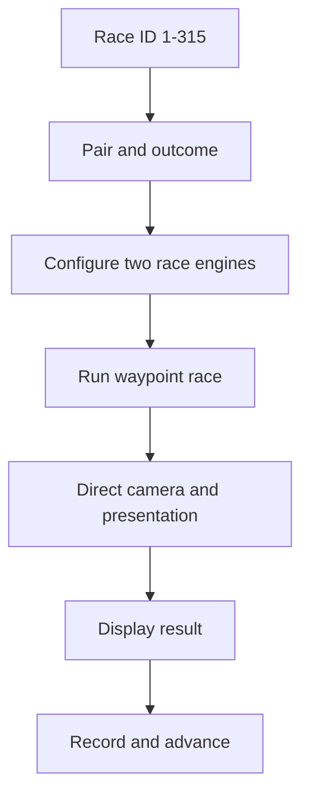

# Horse Racer Simulation

[](https://github.com/kendarte/horse-racer-simulation/actions/workflows/validate-production-data.yml)

A deterministic Unity race simulation that generates, directs, presents, and records a complete matrix of 1v1 horse races.

[View the portfolio case study and full race video](https://kendarte.github.io/projects/horse-racer/)

## Project at a glance

| System | Scale |
| --- | ---: |
| Horses | 10 |
| Unique 1v1 pairings | 45 |
| Result types per pairing | 7 |
| Deterministic race configurations | 315 |

One race ID selects both the competitors and the finish condition. This makes every result reproducible without maintaining 315 hand-authored scenes.

## What I built

- A race orchestrator that converts IDs `1-315` into pairing and outcome indices.
- A duration-driven movement engine for two independent waypoint lanes.
- Timing rules for long wins, short wins, photo finishes, and dead heats.
- A cinematic camera director with progress-based cuts, configurable presets, shot history, and a fixed photo-finish setup.
- Horse presentation logic for animation states and world-space name tags.
- An edit-mode track generator for circular and oval lane layouts.
- An automated Unity Recorder workflow with deterministic filenames and batch progression.
- Custom inspectors for controlling race batches and recording from the Unity Editor.

## System flow



## Code samples

| Area | File | Responsibility |
| --- | --- | --- |
| Core | [`RaceOrchestrator.cs`](CodeSamples/Core/RaceOrchestrator.cs) | Pair selection, outcome mapping, countdown, gates, UI, camera target, and batch sequencing. |
| Core | [`RaceEngine.cs`](CodeSamples/Core/RaceEngine.cs) | Waypoint path construction, duration-based movement, animation coordination, audio, and dust. |
| Core | [`CinematicCamera.cs`](CodeSamples/Core/CinematicCamera.cs) | Broadcast-style shot presets, race-progress triggers, smart cuts, FOV, smoothing, and photo finish. |
| Core | [`HorseNPC.cs`](CodeSamples/Core/HorseNPC.cs) | Idle/trot/run/finish animation states and camera-facing horse labels. |
| Core | [`TrackGenerator.cs`](CodeSamples/Core/TrackGenerator.cs) | Edit-mode generation of two waypoint lanes in circle or oval layouts. |
| Core | [`CameraFollow.cs`](CodeSamples/Core/CameraFollow.cs) | Lightweight smooth-follow camera fallback. |
| Core | [`SimpleAudioPlayer.cs`](CodeSamples/Core/SimpleAudioPlayer.cs) | Small ambient-audio startup helper. |
| Recording | [`BatchRecorder.cs`](CodeSamples/Recording/BatchRecorder.cs) | Unity Recorder configuration, filenames, capture lifecycle, and race handoff. |
| Recording | [`BatchRecorderEditor.cs`](CodeSamples/Recording/BatchRecorderEditor.cs) | Custom recording controls and output-folder selection. |
| Editor | [`RaceOrchestratorEditor.cs`](CodeSamples/Editor/RaceOrchestratorEditor.cs) | Custom controls and progress display for automated race batches. |

The data mapping, movement model, and integration boundaries are explained in [`docs/architecture.md`](docs/architecture.md).

## Production evidence

The public data package makes the production scale auditable instead of relying on a claim:

- [Complete 315-row race manifest](docs/data/race-manifest.csv)
- [Validated 45-pair matrix](docs/data/pair-matrix.csv)
- [Final production specification and validation rules](docs/production-spec.md)
- [Reproducible manifest validator](tools/validate_manifest.py)

Together, the working video, manifest and C# samples show the result, the complete configuration coverage and the implementation behind it.

## Design intent

The central decision was to represent race content as data and timing rules instead of duplicated scenes:

```text
10 x 9 / 2 = 45 unique pairs
45 pairs x 7 outcomes = 315 race configurations
```

The orchestrator gives the movement, camera, animation, UI, and recording systems one shared race definition.

## Verified result

The [portfolio case study](https://kendarte.github.io/projects/horse-racer/) includes the complete race video. It shows configured competitors, duration-based movement, progress-driven camera changes, finish presentation, and the recorded result working together in Unity.

This was an independently developed project. Kendall Angulo Jhonson designed and programmed the race orchestration, movement, cinematic direction, editor tooling, track generation, presentation, and automated capture workflow.

## Repository scope

This is a focused code-sample repository, not a standalone Unity project. It intentionally excludes models, animations, audio, scenes, commercial assets, and third-party packages.

Integration notes:

- The samples depend on scene references and serialized Inspector configuration from the original project.
- `BatchRecorder.cs` and the custom inspectors use Unity Editor APIs. They belong in an editor-only assembly or folder when integrated into another project.
- MP4 capture requires the Unity Recorder package.
- The presentation sample uses the legacy `Animation` component and `UnityEngine.UI.Text`.
- The files have been preserved as production samples; no claim is made that this repository alone opens as a playable build.

## Author

Kendall Angulo Jhonson — Unity Gameplay & Systems Developer  
[Portfolio](https://kendarte.github.io/) · [LinkedIn](https://www.linkedin.com/in/kendall-angulo-jhonson-b46326140/)

See [`NOTICE.md`](NOTICE.md) for repository usage terms.
