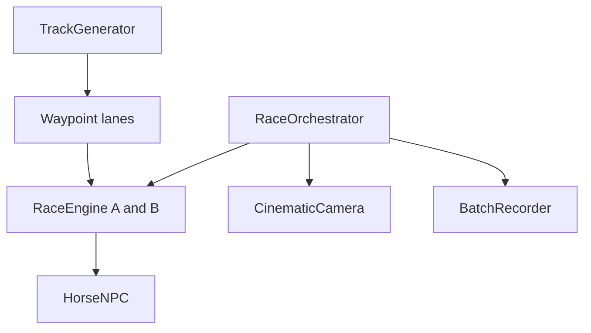

# Architecture notes

## Race ID mapping

`RaceOrchestrator.SetupRace` converts the public race ID into zero-based indices:

```csharp
int adjustedID = Mathf.Clamp(id - 1, 0, 314);
int pairIndex = adjustedID / 7;
int outcomeIndex = adjustedID % 7;
```

`pairIndex` selects one of the 45 unordered pairs generated from 10 horses. `outcomeIndex` selects one of seven timing configurations.

| Outcome index | Result |
| ---: | --- |
| 0 | Horse A, long win |
| 1 | Horse B, long win |
| 2 | Horse A, short win |
| 3 | Horse B, short win |
| 4 | Horse A, photo finish |
| 5 | Horse B, photo finish |
| 6 | Dead heat |

The orchestrator expresses each result by adjusting both racers' target durations around `BaseTime`:

- Long win: `2.0` second separation.
- Short win: `0.5` second separation.
- Photo finish: `0.05` second separation.
- Dead heat: identical durations.

## Runtime responsibilities

### RaceOrchestrator

1. Restores or initializes the current batch ID.
2. Maps the ID to a horse pair and finish condition.
3. Activates only the selected racers.
4. Configures both lane engines with target durations.
5. Assigns the expected winner to the camera director.
6. Runs gates, countdown, audio, finish UI, and completion callbacks.
7. Persists the next ID and reloads the scene during automated batches.

### RaceEngine

1. Finds the closest start and finish waypoints on its assigned lane.
2. Builds an ordered path and cumulative distance table.
3. Calculates maximum speed from path distance and target duration.
4. Applies a smooth acceleration phase followed by constant-speed travel.
5. Samples the path by distance and rotates toward a look-ahead point.
6. Coordinates idle, trot, run, and finish presentation.
7. Starts and stops audio and a procedural dust particle system.

For acceleration duration `tA`, maximum speed `vMax`, path length `D`, and target duration `T`:

```text
vMax = D / (T - 0.5 * tA)
```

The denominator accounts for the distance lost while accelerating from rest.

### CinematicCamera

The camera director is driven by the same race state:

- `TomaTV` exposes reusable shot presets such as close tracking, ground tracking, rear chase, distant static shots, and photo finish.
- The editable shot sequence can trigger cuts at exact percentages of track progress.
- `BroadcastInteligente` measures the separation between active racers and selects framing appropriate to the current spread.
- A three-shot history reduces immediate repetition during dynamic sections.
- Position, look direction, and FOV have independent transition behavior.
- The photo-finish preset can copy an exact finish-post position and rotation.
- `SetTarget` keeps the director focused on the racer selected by the orchestrator.

### HorseNPC

`HorseNPC` owns the presentation layer for each competitor:

- Legacy `Animation` clip playback for idle, trot, run, and finish.
- Runtime animation-speed changes from `RaceEngine`.
- World-space name labels with outline/glow copies and optional blinking.
- Camera-facing label orientation.

### TrackGenerator

`TrackGenerator` runs in edit mode and produces two ordered waypoint lanes. Circle and oval layouts share the same sample count, with independent lane radii or widths. This keeps both `RaceEngine` instances aligned to equivalent track geometry.

### Recording and editor tools

`BatchRecorder` receives the horse names, result label, and race ID; creates a deterministic filename; starts Unity Recorder after a delay; and returns control to the orchestrator when capture finishes.

`BatchRecorderEditor` and `RaceOrchestratorEditor` expose production controls for output selection, starting or stopping automated batches, and viewing current progress.

## Integration boundaries



The small `CameraFollow` and `SimpleAudioPlayer` components are independent presentation helpers.

## Known production constraints

- Pair generation currently assumes exactly 10 configured horses.
- The UI sample uses the legacy `UnityEngine.UI.Text` component.
- Auto-run progress is persisted with `PlayerPrefs` and scene reloads.
- The presentation sample uses the legacy `Animation` component.
- Recording depends on `UnityEditor.Recorder` and is editor-side workflow code.
- Scene references, assets, package setup, and serialized values are outside this code-sample repository.
- These files document the original system architecture; this repository alone is not a standalone playable Unity project.
