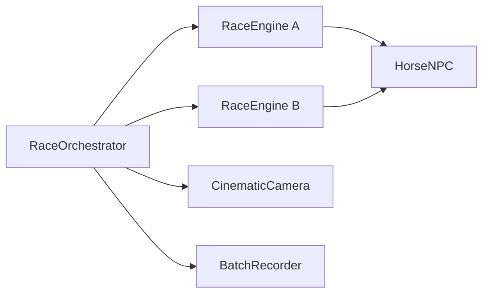

# Architecture notes

## Race ID mapping

`RaceOrchestrator.SetupRace` converts the public race ID into zero-based indices:

```csharp
int adjustedID = Mathf.Clamp(id - 1, 0, 314);
int pairIndex = adjustedID / 7;
int outcomeIndex = adjustedID % 7;
```

`pairIndex` selects one of the 45 unordered pairs generated from 10 horses. `outcomeIndex` selects one of seven timing configurations.

| Outcome index | Result |
| ---: | --- |
| 0 | Horse A, long win |
| 1 | Horse B, long win |
| 2 | Horse A, short win |
| 3 | Horse B, short win |
| 4 | Horse A, photo finish |
| 5 | Horse B, photo finish |
| 6 | Dead heat |

The orchestrator expresses the result by adjusting each horse's target duration around `BaseTime`:

- Long win: `2.0` second separation.
- Short win: `0.5` second separation.
- Photo finish: `0.05` second separation.
- Dead heat: identical durations.

## Runtime responsibilities

### RaceOrchestrator

1. Restores or initializes the current batch ID.
2. Maps the race ID to a pair and finish condition.
3. Activates only the selected racers.
4. Configures both lane engines with target durations.
5. Assigns the expected winner to the camera director.
6. Runs gates, countdown, audio, finish UI, and completion callbacks.
7. Persists the next ID and reloads the scene during auto-run batches.

### RaceEngine

1. Finds the closest start and finish waypoints on its assigned lane.
2. Builds an ordered path and cumulative distance table.
3. Calculates a maximum speed from path distance and target duration.
4. Applies a smooth acceleration phase followed by constant-speed travel.
5. Samples the waypoint path by distance and rotates toward a look-ahead point.
6. Synchronizes idle, trot, run, and finish presentation.
7. Starts and stops audio and a procedural dust particle system.

For an acceleration duration `tA`, maximum speed `vMax`, path length `D`, and target race duration `T`, the configuration uses:

```text
vMax = D / (T - 0.5 * tA)
```

The denominator accounts for the distance lost while accelerating from rest.

### BatchRecorder

1. Receives horse names, outcome label, and race ID.
2. Sanitizes those values into a deterministic filename.
3. Starts Unity Recorder after a configurable delay.
4. Stops capture when the orchestrator raises its completion event.
5. Returns control to the orchestrator so the next race can begin.

## Integration boundaries



`HorseNPC` and `CinematicCamera` are project-specific dependencies and are not distributed in this portfolio repository. The recording sample also requires the Unity Recorder package and is intended for editor-side production use.

## Known production constraints

- Pair generation currently assumes exactly 10 configured horses.
- The UI sample uses the legacy `UnityEngine.UI.Text` component.
- Auto-run progress is persisted with `PlayerPrefs` and scene reloads.
- The recorder sample depends on `UnityEditor.Recorder`; it is not part of the player runtime.
- Scene, asset, and package setup are intentionally outside the scope of this code-sample repository.
